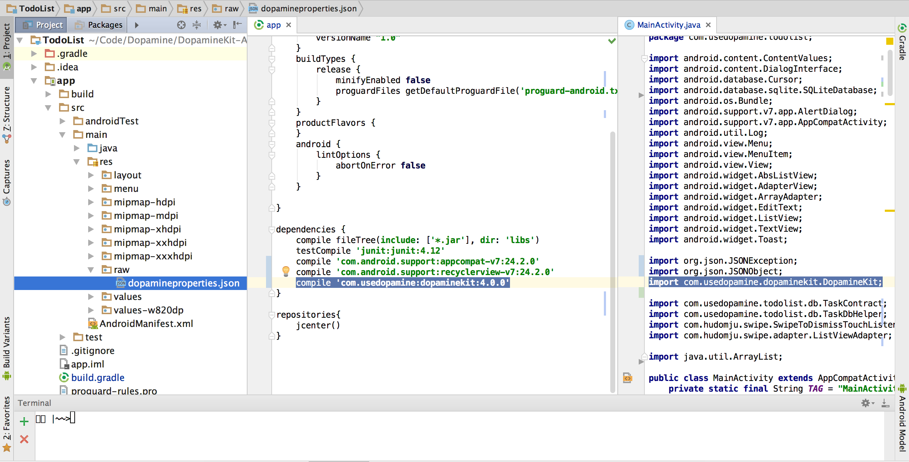

# What is BoundlessKit?
 [  ](https://bintray.com/cuddergambino/maven/boundlesskit/_latestVersion)
 
[](https://bintray.com/cuddergambino/maven/boundlesskit)

[](mailto:oss@boundless.ai)


BoundlessKit provides wrappers for accessing BoundlessAI and expressive UI reinforcements for your app.

Learn more at [boundless.ai](https://boundless.ai)

### Looking for an Android Example App?

A simple "To Do List" Android App is included in this repo to demonstrate how BoundlessKit may be used in your code.

## Integrating BoundlessKit

  1. First, make sure you have received your API key and other credentials, which are in the configuration file __boundlessproperties.json__ automatically generated from the [Boundless Developer Dashboard](http://dashboard.boundless.ai).

  2. Import the BoundlessKit framework into your app's `build.gradle` by using JCenter or Maven using the following line

  ```groovy
  repositories {
        jcenter() // or if you prefer mavenCentral()
    }
    
  dependencies {
        compile 'boundless:boundlesskit:4.0.7'
  	}
  ```

  3. Import the BoundlessKit library

  ```java
  import boundless.BoundlessKit;
  ```

  4. Move __boundlessproperties.json__ into the directory _`app/src/main/res/raw`_

  
  *Shown from the left to right pane:*
    
  - *left: credentials file stored at `app/src/main/res/raw/boundlessproperties.json`,*

  - *center: gradle BoundlessKit dependency*

  - *right: java import of BoundlessKit*
  
  5. Start using BoundlessAI! The main features of BoundlessKit are the `BoundlessKit.reinforce()` and `BoundlessKit.track()` functions. These should be added into the response functions of any _action_ to be reinforced or tracked.

## Using BoundlessKit

###### BoundlessKit.reinforce()

  -  For example, when a user marks a task as completed in a "To Do List" app or logs food in a "Diet" app, you should call `BoundlessKit.reinforce()`.

  ```java
	JSONObject metaData = new JSONObject().put("taskName", taskName);
    BoundlessKit.reinforce(getBaseContext(), 
                          "taskCompleted", 
                          metaData,
                          new BoundlessKit.ReinforcementCallback() {

        @Override
        public void onReinforcement(String reinforcementDecision) {
                                        
            // Multiple reinforcements can help increase the surprise factor!
            // You can also use any UI components you made like
            // this.showInspirationalQuote() or this.showFunnyMeme()

            if(reinforcementDecision.equals("stars")){
                
            }
            else if(reinforcementDecision.equals("medalStar")){
                
            }
            else if(reinforcementDecision.equals("thumbsUp")){

            }
            else {
                // Show nothing! This is called a neutral response,
                // and builds up the good feelings for the next surprise!
            }
        }

    });

  ```  

###### BoundlessKit.track()

  - The `BoundlessKit.track()` function is used to track other user actions. Using `track()` gives BoundlessAI a better understanding of user behavior, and will make your optimization and analytics better.
  - Continuing the example, you could use `BoundlessKit.track()` function to record when the user adds new tasks in your AddTaskActivity's `addTask()` method for the  "To Do List" app, or  record `userLoggedFoodItem()` in the "Diet" app.


  Let's track when a user adds a food item in a "Diet" app. We will also add the calories for the item in the `metaData` field to gather richer information about user engagement in my app.

  ```java
    JSONObject metaData = new JSONObject().put("calories", "400");
    BoundlessKit.track(getBaseContext(), "foodItemAdded", metaData);
   ```


## Super Users

There are additional parameters for the `track()` and `reinforce()` functions that are used to gather rich information from your app and better create a user story of better engagement.

========

#### Tracking Calls

A tracking call should be used to record and communicate to BoundlessAI that a particular action has been performed by the user, each of these calls will be used to improve the reinforcement model used for the particular user. The tracking call itself is asynchronous and non-blocking. Failed tracking calls will not return errors, but will be noted in the log.

###### General syntax

```
BoundlessKit.track(context, actionID, metaData)
```

###### Parameters:

 - `context: Context` - is used to get API credentials from `res/raw/boundlessproperties.json` of the context's package

 - `actionID: String` - is a unique name for the action that the user has performed

 - `metaData: @Nullable JSONObject` - is any additional data to be sent to the API

========

#### Reinforcement Calls

A reinforcement call should be used when the user has performed a particular action that you wish to become a 'habit', the reinforcement call will return the name of the feedback function that should be called to inform, delight or congratulate the user. The names of the reinforcement functions, the feedback functions and their respective pairings may be found and configured on the developer dashboard.

###### General syntax

```
BoundlessKit.reinforce(context, actionID, metaData, callback)
```

###### Parameters:

 - `context: Context` - is used to get API credentials from `res/raw/boundlessproperties.json` of the context's package

 - `actionID: String` - is a unique name for the action that the user has performed

 - `metaData: @Nullable JSONObject` - is any additional data to be sent to the API

 - `callback: BoundlessKit.ReinforcementCallback` - is an object on which `onReinforcement(String reinforcementDecision)` is called when a response is received

========

#### boundlessproperties.json

`boundlessproperties.json ` is the credential file received from the [developer dashboard](https://dashboard.boundless.ai) with your app's specific keys and configuration variables needed to make valid calls to the API.

The JSON file must be in the _`raw/`_ directory, or the JSON string can be set using `BoundlessAPI.setCredentials(context, JSONString)`.

 - `appID: String` - uniquely identifies your app, get this from your [developer dashboard](https://dashboard.boundless.ai).

 - `versionID: String` -  this is a unique identifier that you choose that marks this implementation as unique in our system. This could be something like 'summer2015Implementation' or 'ClinicalTrial4'. Your `versionID` is what we use to keep track of what users are exposed to what reinforcement and how to best optimize that.

 - `inProduction: Bool` - indicates whether app is in production or development mode, when you're happy with how you're integrated BoundlessKit and ready to launch set this argument to `true`. This will activate optimized reinforcement and start your billing cycle. While set to `false` your app will receive dummy reinforcement, new users will not be registered with our system, and no billing occurs.

 - `productionSecret: String` - secret key for production

 - `developmentSecret: String` - secret key for development
